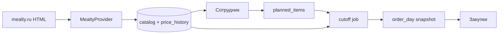

# Архитектура

## Обзор

**CorpLunch** — монорепозиторий, **модульный монолит** на этапах 0–4: один FastAPI, один Postgres, пакеты с жёсткими границами. Каталог приходит из адаптера `MealtyProvider` (HTML главной [mealty.ru](https://www.mealty.ru)). Другие сайты — тот же `FoodProvider`.

Трое в команде: Бондарь А.Р. — ядро и DevOps, Пягай — простой backend и docs, Шишков — React и QA ([team.md](team.md)). Backend — один сервис FastAPI.



## Структура репозитория (целевая)

```
kis/
  backend/                 FastAPI, SQLAlchemy 2, Alembic, pytest
    app/
      auth/                JWT, зависимости ролей
      users/               пользователи, отделы
      catalog/             блюда, категории, история цен
      providers/           FoodProvider, MealtyProvider
      planning/            планы сотрудников
      orders/              дневной снимок, агрегат, экспорт
      stats/               отчёты закупок
      jobs/                APScheduler: sync + cutoff
  frontend/                Vite + React + TypeScript + TanStack Query
  docker-compose.yml
  docs/
  README.md
```

Контракт между командами — OpenAPI (`/docs` у FastAPI). Клиент на фронте в итоге лучше генерировать из схемы, а не писать URL руками. На этапе 0 Бондарь кладёт тонкий `api.ts`; генерацию включаем, когда стабильны login и `GET /api/me`.

## Модули backend

| Пакет | Ответственность | Кто использует |
|-------|-----------------|----------------|
| `auth` | логин, JWT, `CurrentUser`, проверка роли | все |
| `users` | CRUD пользователей и отделов, настройки системы | admin, статистика |
| `catalog` | upsert блюд, `price_history`, выдача текущего меню | employee, parser, cutoff |
| `providers` | нормализация внешнего каталога, без знания БД заказов | catalog sync |
| `planning` | план на дату, qty, `planned_price_kopecks`, cutoff-блокировка | employee |
| `orders` | office_order, агрегация, CSV/XLSX, ручной cutoff, статус placed | procurement |
| `stats` | агрегаты за период | procurement, admin |
| `jobs` | расписание sync каталога и cutoff | инфраструктура |

Граница модулей: `providers` возвращает `NormalizedDish`, `catalog` пишет в БД, `planning` не ходит на Mealty напрямую.

## Интерфейс провайдера

```python
class FoodProvider(Protocol):
    source: str  # "mealty"

    async def fetch_catalog(self) -> list[NormalizedDish]:
        ...
```

`NormalizedDish` (цены сразу в копейках, как в `dishes`):

| Поле | Смысл |
|------|--------|
| `external_id` | стабильный id на сайте (`data-product_id`) |
| `seller_product_id` | `data-seller-product_id`, nullable |
| `name`, `subtitle` | название и уточнение |
| `description` | текст карточки, nullable |
| `category` | `breakfast`, `salad`, `soup`, `main_dish`, … |
| `price_kopecks`, `old_price_kopecks` | текущая и зачёркнутая цена |
| `weight_g` | вес |
| `proteins`, `fats`, `carbs`, `calories` | КБЖУ |
| `image_url` | абсолютный URL картинки |
| `available` | есть в свежем снимке |

В БД блюдо уникально парой `source + external_id` (например `mealty` + `875`).

## Фоновые задачи

1. **Catalog sync** — 1–2 раза в сутки (утро). Пишет/обновляет `dishes`, добавляет строку в `price_history`, блюда, которых нет в свежем HTML, помечает `available=false`.
2. **Cutoff job** — в настроенное время (по умолчанию 16:00) для **завтрашней** даты: синхронизирует каталог, переводит планы `draft → locked → priced → included_in_order`, заполняет `actual_price_kopecks` / `unavailable`, собирает `office_order`.

Ручной `POST /api/catalog/sync` доступен закупкам, если нужно обновить меню не дожидаясь cron. Ручной `POST /api/orders/{date}/cutoff` — тот же алгоритм, что у job, для указанной даты (демо, не ждать 16:00).

## Frontend

Экраны MVP (все — Шишков, по [ui.md](ui.md)):

1. Вход.
2. Каталог + календарь плана — сотрудник.
3. Сводка дня — закупки (в т.ч. «закрыть приём»).
4. Статистика — закупки/админ.
5. Пользователи, отделы, настройки — админ. Стартовать, как только живы `/api/admin/users` и `/api/admin/settings` (Пягай), не к защите.

JWT только в заголовке `Authorization: Bearer …` (без cookie). Демо-вход без SSO.

## Инфраструктура

Docker Compose MVP: `db`, `api`, `web`. Backend читает `DATABASE_URL`, `JWT_SECRET`, `JWT_EXPIRE_MINUTES` (по умолчанию 480), `MEALTY_CITY`, `CUTOFF_TIME`. Пароли — bcrypt. Frontend проксирует `/api` на backend.


## Принципы командной разработки

- Коммиты сразу в `main`. Ветки и PR по желанию, не как шлюз.
- Миграции Alembic в том же изменении, что и схема, без ручного SQL на общей БД.
- Ломающий OpenAPI — отдельное согласование с тимлидом в том же изменении.
- Тесты парсера используют фикстуру HTML, не живой сайт.
