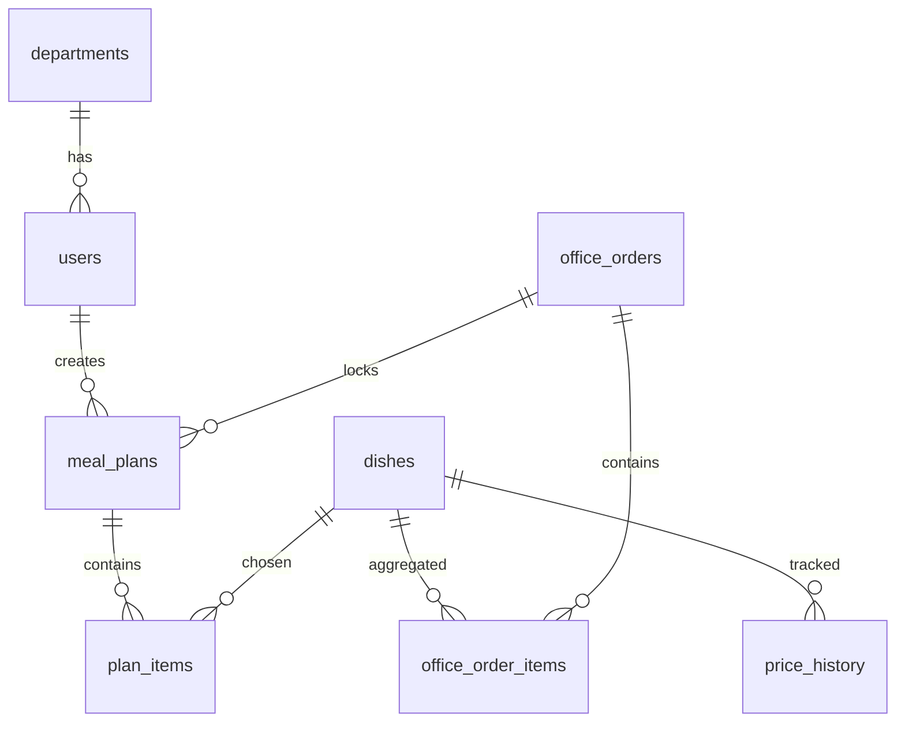

# Модель данных

Цены храним в копейках (`integer`), чтобы не ловить ошибки float. Даты планов — календарные `date` в часовом поясе офиса (`Europe/Moscow`).

## ER-обзор



## Таблицы

### `departments`

| Поле | Тип | Описание |
|------|-----|----------|
| id | PK | |
| name | str | «Разработка», «Закупки», … |

Нужны для статистики расхода, не для ACL.

### `users`

| Поле | Тип | Описание |
|------|-----|----------|
| id | PK | |
| email | unique | логин |
| password_hash | str | |
| full_name | str | |
| role | enum | `employee`, `procurement`, `admin` |
| department_id | FK nullable | |
| daily_limit_kopecks | int nullable | персональный лимит; иначе системный |
| is_active | bool | |

### `settings` (одна строка или key-value)

| Ключ | Значение по умолчанию | Смысл |
|------|----------------------|--------|
| `cutoff_time` | `16:00` | до какого времени правится план на завтра |
| `timezone` | `Europe/Moscow` | |
| `mealty_city` | `Москва` | влияет на цены парсера |
| `daily_limit_kopecks` | null | общий лимит ₽/сотрудник/день, опционально |
| `catalog_sync_per_day` | `2` | мягкий лимит запросов к Mealty |

### `dishes`

| Поле | Тип | Описание |
|------|-----|----------|
| id | PK | внутренний |
| source | str | `mealty` |
| external_id | str | `data-product_id` |
| seller_product_id | str nullable | `data-seller-product_id` |
| name | str | |
| subtitle | str | `.meal-card__name-note` |
| category | str | `breakfast`, `salad`, … |
| price_kopecks | int | последняя известная цена |
| old_price_kopecks | int nullable | |
| weight_g | int nullable | |
| proteins, fats, carbs, calories | numeric nullable | |
| image_url | str nullable | |
| description | text nullable | |
| available | bool | есть в последнем sync |
| unique | (source, external_id) | |

### `price_history`

Снимок при каждом успешном sync.

| Поле | Тип |
|------|-----|
| id | PK |
| dish_id | FK |
| price_kopecks | int |
| recorded_at | timestamptz |

Нужна для графиков и отчёта «план vs факт».

### `meal_plans`

Один план = один сотрудник × одна дата доставки.

| Поле | Тип | Описание |
|------|-----|----------|
| id | PK | |
| user_id | FK | |
| delivery_date | date | |
| status | enum | см. ниже |
| office_order_id | FK nullable | после сборки дня |
| unique | (user_id, delivery_date) | |

Статусы плана:

```
draft → locked → priced → included_in_order
```

| Статус | Когда |
|--------|--------|
| `draft` | можно редактировать до cutoff |
| `locked` | cutoff прошёл, правки запрещены |
| `priced` | проставлены actual_price / unavailable |
| `included_in_order` | вошёл в сводный office_order |

### `plan_items`

| Поле | Тип | Описание |
|------|-----|----------|
| id | PK | |
| plan_id | FK | |
| dish_id | FK | |
| qty | int ≥ 1 | |
| planned_price_kopecks | int | цена на момент добавления/последнего sync в draft |
| actual_price_kopecks | int nullable | цена после cutoff |
| unavailable | bool | блюда не было в свежем каталоге |

В сводку закупок позиция попадает, только если `unavailable = false`.

### `office_orders`

Сводный заказ офиса на дату доставки.

| Поле | Тип | Описание |
|------|-----|----------|
| id | PK | |
| delivery_date | date unique | |
| status | enum | см. ниже |
| placed_at | timestamptz nullable | |
| placed_by_user_id | FK nullable | |

Статусы сводного заказа:

```
collecting → locked → exported → placed
```

| Статус | Когда |
|--------|--------|
| `collecting` | ещё идут draft-планы |
| `locked` | cutoff, планы зафиксированы |
| `exported` | хотя бы раз скачали CSV/XLSX |
| `placed` | закупки подтвердили размещение на Mealty |

### `office_order_items`

Агрегат по блюду (не по человеку). Персональная разбивка считается из `plan_items`.

| Поле | Тип |
|------|-----|
| office_order_id | FK |
| dish_id | FK |
| qty | int |
| unit_price_kopecks | int (actual) |
| line_total_kopecks | int |

## Правило цены

1. Пока план `draft`, UI показывает `dishes.price_kopecks` (последний sync). При добавлении в план копируем её в `planned_price_kopecks`.
2. После cutoff job: для каждой позиции, если блюдо `available` — `actual_price_kopecks = dishes.price_kopecks`; иначе `unavailable = true`, в агрегат не входит.
3. Дельта для статистики: `actual_price * qty − planned_price * qty` (unavailable можно считать отдельно: «не закуплено»).

## Индексы

- `dishes (source, external_id)` unique
- `meal_plans (user_id, delivery_date)` unique
- `meal_plans (delivery_date, status)`
- `price_history (dish_id, recorded_at)`
- `office_orders (delivery_date)` unique
