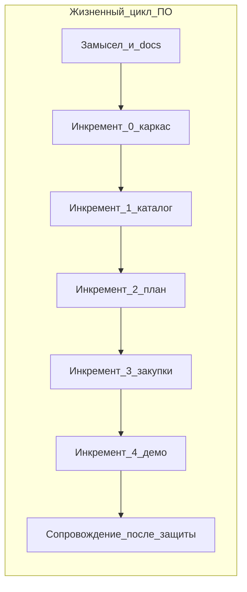
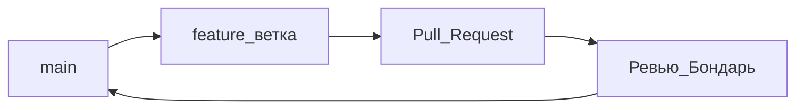

# Жизненный цикл и метод разработки

Проект: **CorpLunch**. Два разных «цикла», их не смешиваем на защите:

1. **Жизненный цикл ПО** — как команда создаёт и сдаёт систему (этот документ).
2. **Жизненный цикл заказа** — как в работающей системе живёт план на дату: draft → cutoff → сводка → placed. Это [roles.md](roles.md) и [data-model.md](data-model.md).

## Решение

| Вопрос                  | Выбор                                                                                                 |
| ----------------------- | ----------------------------------------------------------------------------------------------------- |
| Модель жизненного цикла | **Итеративно-инкрементальная**                                                                        |
| Метод разработки        | **Облегчённый Scrum + GitHub Flow**                                                                   |
| Почему не каскад        | Этапы 0–4 уже перекрываются, трое работают параллельно, требования уточняются по факту парсера Mealty |
| Почему не полный Scrum  | Нет выделенного Scrum-мастера и Product Owner; команда из трёх, учебный темп                          |

Каскад («сначала всё спроектировать, потом всё написать, потом тестировать») для этого проекта вреден: Шишков тогда ждал бы готовый API неделями, Пягай — стабильную схему. Спираль избыточна: рисков мало, заказчик учебный.

Итерации дают работающий кусок каждый этап. Инкременты складываются в MVP к защите: каркас → каталог → план → сводка → статистика.

Инкременты **перекрываются по календарю** (см. [sprints.md](sprints.md)): следующий стартует, когда готов контракт предыдущего, не когда «всё идеально».

## Фазы жизненного цикла ПО

Классические фазы есть, но они **повторяются в каждом инкременте**, а не один раз на весь проект.

| Фаза                 | Когда в курсе                                      | Кто                                   | Артефакт                             |
| -------------------- | -------------------------------------------------- | ------------------------------------- | ------------------------------------ |
| Замысел и требования | до кода, затем уточнения                           | Бондарь (решения), Пягай (текст docs) | vision, API, модель данных           |
| Проектирование       | коротко в каждом этапе                             | Бондарь                               | architecture, OpenAPI                |
| Реализация           | недели 1–9                                         | все по [team.md](team.md)             | код в feature-ветках                 |
| Проверка             | внутри этапа, не «в конце семестра»                | Шишков (QA), pytest парсера           | чек-лист, PR                         |
| Поставка             | конец этапа = демо внутри команды; этап 4 = защита | Бондарь принимает                     | `docker compose up`                  |
| Сопровождение        | после защиты, по желанию                           | не обязательно для курса              | фикстура, если Mealty сменил вёрстку |

Документация **не заменяет** итерации: пакет `docs/` — это зафиксированные требования MVP, а не водопад «больше не меняем». Ломающий API — только с согласия тимлида, docs правит Пягай в том же изменении.

## Метод: облегчённый Scrum

Берём из Scrum то, что работает на троих. Не берём церемонии ради церемоний.

### Роли Scrum → наша команда

| Scrum         | У нас                                   |
| ------------- | --------------------------------------- |
| Product Owner | Бондарь (приоритет MVP, «что в защиту») |
| Scrum Master  | нет; ритуал держит тимлид 15 минут      |
| Developers    | Бондарь, Пягай, Шишков                  |

### Бэклог

Единый список — этапы 0–4 плюс мелочь в GitHub Issues. Источник правды по объёму MVP — [vision.md](vision.md). Вне MVP в спринт не тащим.

Инкремент = этап из [sprints.md](sprints.md):

- этап 0 — ~1 неделя (один спринт);
- этапы 1–4 — ~2 недели (спринт).

Спринты могут накладываться по людям (Шишков уже верстает каталог, пока Бондарь дописывает sync).

### События (короткие)

| Событие              | Как часто                                     | Как делаем                                     |
| -------------------- | --------------------------------------------- | ---------------------------------------------- |
| Планирование спринта | старт этапа                                   | 30–40 мин: что входит, критерии проверки этапа |
| Ежедневный синхрон   | 2–3 раза в неделю, не обязательно каждый день | 10–15 мин: что сделано, что блокирует          |
| Обзор                | конец этапа                                   | прогон проверки из sprints.md                  |
| Ретро                | по желанию, после этапов 2 и 4                | 15 мин: что мешало (ревью, API)                |

Нет story points и burndown. Оценка уже календарная в sprints.md.

### GitHub Flow (как доставляем код)

- `main` всегда должен подниматься через Compose.
- Ветка от `main`, PR, merge после ревью Бондаря.
- Шишков прилагает скрин или чек-лист; Пягай — что изменилось в docs; Бондарь — pytest по своей зоне.
- Релизы не нумеруются до защиты: поставка = зелёный `main` на момент демо этапа.

Definition of Done — в [team.md](team.md): миграция при смене схемы, проверка, docs не врут, compose с нуля.

## Качество в цикле, а не в конце

- Парсер: регресс на HTML-фикстуре в каждом PR, который трогает селекторы.
- Шишков: чек-лист этапа до обзора, не «протестируем перед защитой».
- Живой mealty.ru не в CI.

Если инкремент не сходится по сроку — режем объём по таблице «если отстаёте» в sprints.md, а не удлиняем каскад.

## Сопровождение

После защиты система учебная. Сопровождение = починить парсер, если Mealty сменил вёрстку, и обновить фикстуру. Новых ролей и микросервисов в ЖЦ нет.

## Как сказать на защите (30 секунд)

CorpLunch сделан итеративно-инкрементально: пять наращиваемых поставок за ~9 недель. Метод — облегчённый Scrum без отдельного Scrum-мастера, поставка кода через GitHub Flow. Требования в docs до кодирования, уточняются по инкрементам. Водопад не использовали: команда работает параллельно с первого дня.

