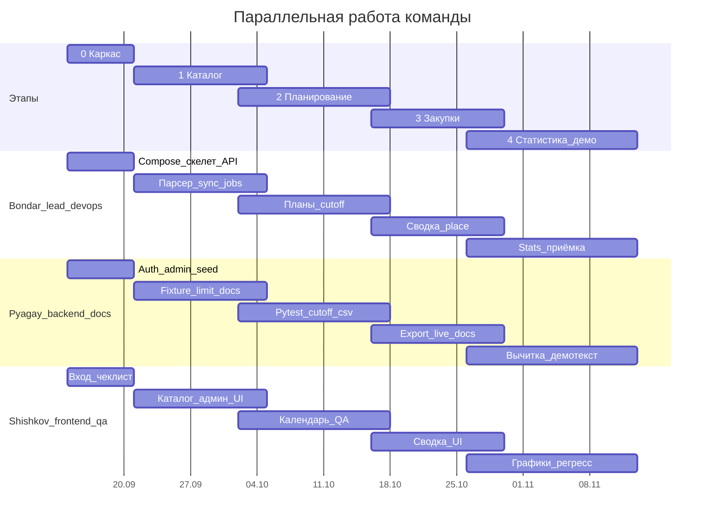

# Этапы реализации и сроки

Команда из трёх человек ([team.md](team.md)). Оценка: **~9 календарных недель** при ~8–12 часов/человека в неделю. Этапы **перекрываются** — это инкременты итеративно-инкрементального ЖЦ, не фазы каскада ([process.md](process.md)).

Даты — **пример** при старте 14 сентября 2026. Важны длительности, не числа. Защита — около **недели 9–10**. Если курс короче: этап 4 без графика, экспорт только CSV.

---

## Этап 0 — каркас (~1 неделя)

Все трое заняты с первого дня.

| Кто | Делает | Готово, когда |
|-----|--------|----------------|
| **Бондарь** | Compose (`db` + api + web), Alembic, `GET /api/health`, образец `GET`/`POST /api/admin/departments`, скелет React (Vite, роутер, тонкий клиент — без экранов), CI pytest | `docker compose up`, `/docs` открывается |
| **Пягай** | README «как запустить»; `auth/` + дописать admin **по образцу отделов** (`PATCH` отделов, CRUD пользователей); `seed-users` (два сотрудника + закупки + админ) | три роли логинятся; `POST /api/admin/users` создаёт учётку |
| **Шишков** | экран входа, шапка/роли, чек-лист логина трёх ролей | вход бьёт реальный `/api/auth/login` |

**Стык:** Шишков до середины недели верстает на моке. Пягай не ждёт парсер. Как только живы `users` (этот этап) и `settings` (этап 1) — Шишков берёт админ-экран, не откладывает.

**Проверка:** три учётки входят в пустой кабинет; seed даёт второго сотрудника; README совпадает с compose.

---

## Этап 1 — каталог (~2 недели, недели 2–3)

| Кто | Делает |
|-----|--------|
| **Бондарь** | `MealtyProvider`, upsert `dishes` + `price_history`, `GET/POST catalog`, job sync |
| **Пягай** | `GET/PUT /api/admin/settings`; CLI `sync-from-fixture` (парсер Бондаря + фикстура, селекторы не трогает); хелперы дневного лимита (422) и квоты sync (429); описание каталога в [api.md](api.md) / [mealty.md](mealty.md) под факт кода |
| **Шишков** | сетка каталога, категории, поиск; **экран админа** (люди, отделы, settings) по живому `/api/admin/*`; фикстура HTML для QA/тестов парсера |

**Стык:** UI каталога подключается, как только стабильны поля JSON, даже если sync ещё ручной. Админ-экран — сразу после живых users/settings, параллельно с сеткой.

**Проверка:** в UI блюда с ценой; админ меняет cutoff/город с экрана; CI без mealty.ru; `sync-from-fixture` наполняет каталог.

---

## Этап 2 — планирование (~2–2,5 недели, недели 3–5)

Старт: есть `dish_id`, не ждать идеального парсера.

| Кто | Делает |
|-----|--------|
| **Бондарь** | `GET/PUT /plans/{date}`, `planned_price_kopecks` / `actual_price_kopecks`, unavailable, cutoff job и `POST /orders/{date}/cutoff` |
| **Пягай** | текст статусов и cutoff в [data-model.md](data-model.md) / [roles.md](roles.md); pytest по контракту (403 после cutoff, роли, идемпотентность `cutoff`/`place`); `conftest` с Bearer трёх ролей; рендер CSV/XLSX на фикстуре DTO, не ждать живой сводки |
| **Шишков** | календарь, состав плана, бейджи; QA: до 16:00 можно, после — нельзя; добить админку, если этап 1 не закрыл экран |

**Проверка:** 403 после cutoff; снятое блюдо не в сумме закупки.

---

## Этап 3 — закупки (~2 недели, недели 5–7)

| Кто | Делает |
|-----|--------|
| **Бондарь** | `GET /orders/{date}`, агрегат, `place`; роутер вызывает рендер Пягая и ставит `locked → exported` |
| **Пягай** | подключить CSV/XLSX к живому DTO сводки, инструкция «как перенести на Mealty» |
| **Шишков** | таблица сводки, кнопки выгрузки и «Заказ размещён», чек-лист закупок |

**Проверка:** файл открывается в Excel; повторный `placed` не ломает заказ.

---

## Этап 4 — статистика и защита (~2–2,5 недели, недели 7–9)

| Кто | Делает |
|-----|--------|
| **Бондарь** | `GET /stats/summary`, приёмка, стабильный compose |
| **Пягай** | вычитка всех docs, текст защиты, описание seed/`sync-from-fixture`; добить пробелы в тестах auth/admin, не stats |
| **Шишков** | фильтры/таблицы/график, полный регресс по [demo.md](demo.md) (в т.ч. админ: завести человека, сменить cutoff) |

**Проверка:** демо 8–10 минут без живого Mealty в аудитории.

---

## Если отстаёте

| Горит | Чем жертвуем |
|-------|----------------|
| Этап 3 | XLSX → только CSV |
| Этап 4 | график → одна таблица |
| Парсер Mealty | демо с фикстуры |
| Заболел Бондарь | Пягай не трогает cutoff; Шишков держит моки; ядро не выдумывать |

Не режем этап 0 и правило цены.
