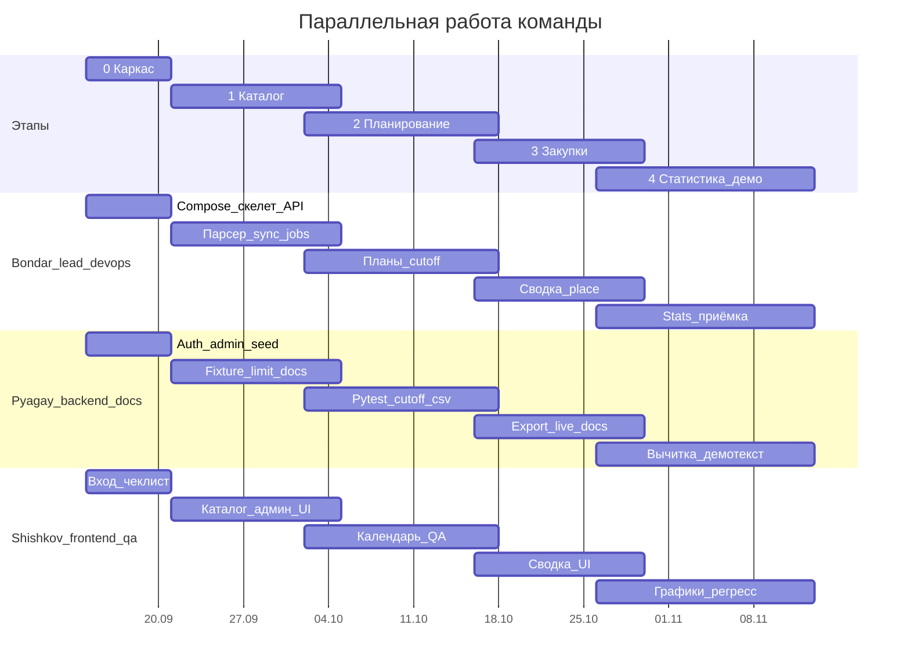

# Этапы реализации и сроки

Команда из трёх человек ([team.md](team.md)). Оценка: **~9 календарных недель** при ~8–12 часов/человека в неделю. Этапы **перекрываются** — это инкременты итеративно-инкрементального ЖЦ, не фазы каскада ([process.md](process.md)).

Контракт смотреть в [api.md](api.md), таблицы — [data-model.md](data-model.md), экраны и копирайт — [ui.md](ui.md). Не придумывать другие эндпоинты и статусы.

Даты — **пример** при старте 14 сентября 2026. Важны длительности, не числа. Защита — около **недели 9–10**. Если курс короче: этап 4 без графика, экспорт только CSV.

---

## Этап 0 — каркас (~1 неделя)

Все трое заняты с первого дня. Цель: `docker compose up --build` поднимает пустое приложение, три роли логинятся.

### Бондарь

- [x] **Compose (**`db` **+ api + web)**
  - Три сервиса в `docker-compose.yml`: PostgreSQL, FastAPI (`api`), Vite (`web`).
  - `.env.example` (не коммитить секреты): `DATABASE_URL`, `JWT_SECRET`, `JWT_EXPIRE_MINUTES` (480), `MEALTY_CITY`, `CUTOFF_TIME`.
  - Frontend проксирует `/api` на backend `:8000`. Веб — `http://localhost:5173`, OpenAPI — `http://localhost:8000/docs`.
  - С нуля: `docker compose up --build` без ручных миграций с хоста.

- [x] **Alembic**
  - Async SQLAlchemy 2 + `asyncpg`. Миграции в том же изменении, что схема.
  - Первая миграция — таблица `departments` под образец ниже. Таблицу `users` не проектировать — это Пягай.

- [x] `GET /api/health`
  - Без авторизации. Ping процесса и Postgres.
  - 200: `{ "status": "ok", "database": "up" }`. Если БД недоступна — 503 `{ "detail": "Database unavailable" }`.
  - Это живой образец «роутер + тест», не заглушка.

- [x] **Образец** `GET`**/**`POST /api/admin/departments`
  - Вертикальный срез для Пягая: модель, миграция, Pydantic-схема, роутер, pytest. Кладётся в пакет `users/` (отделы).
  - `GET` — список `[{ "id", "name" }]`. `POST` — тело `{ "name" }` → 201 и объект отдела.
  - Пока можно без JWT (auth ещё нет) **или** с временной заглушкой — согласовать с Пягаем в первый день, чтобы он сразу копировал структуру.
  - **Не писать:** логин, таблицу `users`, `PATCH` отделов, CRUD пользователей.

- [x] **Скелет React (без экранов)**
  - Vite + TypeScript `strict` + роутер. Тонкий `api.ts` (ручные URL, без генерации из OpenAPI — генерацию включим после стабильных login / `GET /api/me`).
  - Пустой layout, без экранов входа/каталога — их рисует Шишков поверх этого каркаса.
  - Стек фронта: TanStack Query, CSS modules / plain CSS. Не ставить UI-kit «фиолетовый SaaS».

- [x] **CI pytest**
  - Простой pipeline: `pytest` без сети на mealty.ru. `main` должен подниматься через Compose.

Готово, когда: `docker compose up`, `/docs` открывается.

### Пягай

- [ ] **README «как запустить»**
  - Команды как в [README.md](../README.md): `docker compose up --build`, порты 5173/8000, таблица демо-учёток.
  - Текст должен совпадать с реальным compose Бондаря. Документ врёт — это баг твоей зоны.

- [x] **Пакет** `auth/`
  - Копировать структуру среза отделов Бондаря (модель / schema / router / pytest), не проектировать заново.
  - `POST /api/auth/login`: тело `{ "email", "password" }` → `{ "access_token", "token_type": "bearer" }`. Неверный пароль — 401.
  - Пароли только bcrypt. JWT в заголовке `Authorization: Bearer …`, cookie не использовать. TTL — `JWT_EXPIRE_MINUTES` (480).
  - `GET /api/me` — текущий пользователь без `password_hash` (поля как в [api.md](api.md)).
  - Зависимости FastAPI: `CurrentUser`, проверка роли (`employee` / `procurement` / `admin`). Все методы кроме login и health требуют Bearer.
  - Неактивный пользователь (`is_active=false`) не логинится.

- [x] **Дописать admin по образцу отделов**
  - `GET`/`POST /api/admin/departments` уже есть — **не переписывать** с нуля.
  - Добавить `PATCH /api/admin/departments/{id}`: тело `{ "name" }`.
  - Таблица `users` + миграция (поля из [data-model.md](data-model.md): email unique, `password_hash`, `full_name`, role enum, `department_id`, `daily_limit_kopecks`, `is_active`).
  - CRUD: `GET /api/admin/users` (список без хеша), `POST /api/admin/users` (201 как `GET /api/me` без пароля), `PATCH /api/admin/users/{id}` (любое подмножество: role, department_id, лимит, is_active, full_name, password).
  - Доступ ко всем `/api/admin/*` — только роль `admin` (403 иначе, 401 без токена).
  - `GET/PUT /api/admin/settings` — **не этот этап**, это этап 1.

- [x] `seed-users`
  - CLI: `python -m app.cli seed-users`. Создаёт отделы и четыре учётки из README: `employee@kis.local` / `employee`, `employee2@kis.local` / `employee2`, `procurement@kis.local` / `procurement`, `admin@kis.local` / `admin`.
  - Два сотрудника обязательны: без них на сводке некого показывать.

Готово, когда: три роли логинятся; `POST /api/admin/users` создаёт учётку.

### Шишков

- [ ] **Экран входа**
  - По [ui.md](ui.md): один столбец — почта, пароль, кнопка «Войти». UI на русском. Тёплый бумажный фон, шалфейный акцент — не фиолетовый шаблон.
  - До середины недели — вёрстка на моке. Как только жив `POST /api/auth/login` — бить реальный API.
  - Успех: сохранить `access_token` в память/`localStorage`, дальше слать `Authorization: Bearer …`. Cookie не использовать.
  - Подсказку демо-учёток показывать только в dev.

- [ ] **Шапка / роли**
  - После входа — шапка с ролью и выходом. Навигация по роли: сотрудник → каталог/план; закупки → сводка и статистика (пока заглушки); админ → ещё пункт настроек (экран админа — этап 1, но пункт меню можно заложить).
  - Пустой кабинет нормален: каталога ещё нет.

- [ ] **Чек-лист логина трёх ролей**
  - QA, не «проверил у себя в голове». Пройти `employee`, `employee2`, `procurement`, `admin`; неверный пароль → ошибка; без токена API не пускает.
  - Чек-лист кладётся в репозиторий или issue, баги не «тихо на своей машине».

Готово, когда: вход бьёт реальный `/api/auth/login`.

**Стык:** Шишков до середины недели верстает на моке. Пягай не ждёт парсер. Как только живы `users` (этот этап) и `settings` (этап 1) — Шишков берёт админ-экран, не откладывает.

**Проверка:** три учётки входят в пустой кабинет; seed даёт второго сотрудника; README совпадает с compose.

---

## Этап 1 — каталог (~2 недели, недели 2–3)

Цель: в UI есть блюда с ценой в ₽; админ меняет cutoff/город; CI не ходит на mealty.ru.

### Бондарь

- [ ] `MealtyProvider`
  - Пакет `providers/`: протокол `FoodProvider` + класс Mealty. Возвращает `NormalizedDish` (копейки, `source="mealty"`), **не знает** таблиц заказов.
  - Селекторы **только** в `app/providers/mealty.py` — см. таблицу в [mealty.md](mealty.md). Не трогать корзину, `/ajax.php`, `/cabinet`, логин Mealty.
  - Город из `settings.mealty_city` (пока Пягай не сделал settings — дефолт Москва / `MEALTY_CITY`).
  - Тесты на `backend/tests/fixtures/mealty_catalog.html` (фикстуру кладёт Шишков): `external_id`, имя, `price_kopecks`, категория; пропавшее блюдо → `available=false`. Живой сайт в CI запрещён.
  - 5xx / пустой HTML — ошибка (потом 502 на sync), **не** массовое `unavailable`.

- [ ] **Upsert** `dishes` **+** `price_history`
  - Пакет `catalog/`. Уникальность `(source, external_id)`. Поля блюда — [data-model.md](data-model.md).
  - Успешный sync: обновить цены/карточки, дописать `price_history`; позиций нет в снимке → `available=false`.
  - Деньги — целые копейки, не float.

- [ ] `GET` **/** `POST` **catalog**
  - `GET /api/catalog` — все авторизованные. Query: `category?`, `q?`, `available_only` (default true). JSON как в [api.md](api.md).
  - `POST /api/catalog/sync` — закупки/админ: `fetch_catalog` + upsert. Ответ `{ upserted, unavailable, recorded_at }`. 502 если Mealty/парсер упал; 429 если превышена квота (хелпер Пягая).

- [ ] **Job sync**
  - APScheduler: 1–2 раза в сутки (утро). Тот же код, что ручной sync. Таймаут и один retry. Не чаще лимита из settings.

### Пягай

- [ ] `GET` **/** `PUT /api/admin/settings`
  - Одна строка или key-value: `cutoff_time` (16:00), `timezone` (Europe/Moscow), `mealty_city` (Москва), `daily_limit_kopecks` (null), `catalog_sync_per_day` (2).
  - `PUT` — полная замена этих ключей. Только `admin`. Это **хранение**, не формула cutoff (формулу пишет Бондарь на этапе 2).

- [ ] **CLI** `sync-from-fixture`
  - `python -m app.cli sync-from-fixture`: вызвать парсер Бондаря на `backend/tests/fixtures/mealty_catalog.html` и upsert в БД.
  - Селекторы **не трогать**. Нужно для демо без живого mealty.ru и для наполнения каталога в dev.

- [ ] **Хелперы лимита (422) и квоты sync (429)**
  - Функции, которые ядро только вызывает: сумма плана > лимита сотрудника/системы → 422; счётчик ручных/job sync за сутки > `catalog_sync_per_day` → 429.
  - Не вшивать это в парсер и не считать cutoff.

- [ ] **Docs каталога под факт кода**
  - Сверить [api.md](api.md) и [mealty.md](mealty.md) с реальными полями/селекторами. Расхождение — баг docs.

### Шишков

- [ ] **Сетка каталога, категории, поиск**
  - Экран сотрудника по [ui.md](ui.md): фильтры категорий, поиск, карточки (фото, имя, цена в ₽ = `price_kopecks / 100`). Кнопки «в план» можно пока без сохранения, если `PUT /plans` ещё нет — главное живой `GET /api/catalog`.
  - Подключаться, как только стабильны поля JSON, даже если sync ещё только через CLI.

- [ ] **Экран админа (люди, отделы, settings)**
  - Начинать сразу, как живы `/api/admin/users` и `/api/admin/settings` — не оставлять на этап 4.
  - Один экран, два блока ([ui.md](ui.md)): слева отделы и таблица пользователей (почта, роль, отдел, лимит ₽/день, активен) + создать/править; справа cutoff, город Mealty, общий лимит. Сохранить настройки → `PUT /api/admin/settings`.
  - Нет экрана «редактировать чужой план».

- [ ] **Фикстура HTML для парсера**
  - Урезанный снимок главной Mealty: 2–3 `.catalog-item` с реальными классами → `backend/tests/fixtures/mealty_catalog.html`.
  - Без этого Бондарь не может закрыть регресс селекторов.

**Стык:** UI каталога подключается, как только стабильны поля JSON, даже если sync ещё ручной. Админ-экран — сразу после живых users/settings, параллельно с сеткой.

**Проверка:** в UI блюда с ценой; админ меняет cutoff/город с экрана; CI без mealty.ru; `sync-from-fixture` наполняет каталог.

---

## Этап 2 — планирование (~2–2,5 недели, недели 3–5)

Старт: есть `dish_id`, не ждать идеального парсера. Цель: сотрудник собирает план; после cutoff — 403 и актуальные цены.

### Бондарь

- [ ] `GET` **/** `PUT /api/plans/{date}`
  - Пакет `planning/`. Дата в URL — `YYYY-MM-DD` (дата **доставки**), пояс `Europe/Moscow`.
  - `GET`: свой план (employee) или любой по `?user_id=` (закупки/админ). Нет плана — пустой draft, `editable` по cutoff.
  - `PUT`: тело `{ "items": [{ "dish_id", "qty" }] }` — полная замена. Только **свой** план и только роль `employee`. Админ чужие планы не редактирует.
  - Сервер копирует текущую `dishes.price_kopecks` в `planned_price_kopecks`. 403 после cutoff или чужой план; 409 — блюдо unavailable / не найдено; 422 — хелпер лимита Пягая.
  - Статусы плана: `draft → locked → priced → included_in_order`.

- [ ] **Правило цены:** `planned` **/** `actual` **/ unavailable**
  - Пока `draft` — в UI ориентир из каталога, в позиции — `planned_price_kopecks`.
  - После cutoff: sync каталога, затем для каждой позиции `available` → `actual_price_kopecks = dishes.price_kopecks`; иначе `unavailable=true`, в агрегат закупок не входит.
  - Не ломать это правило без правки docs.

- [ ] **Cutoff job и** `POST /api/orders/{date}/cutoff`
  - Формула ([roles.md](roles.md)): для доставки `D` правки, пока `now < (D − 1 день) + cutoff_time` в `Europe/Moscow`. Дефолт 16:00 накануне.
  - Job в это время для **завтрашней** даты: sync → планы `draft → locked → priced → included_in_order` → `office_order` в `locked`.
  - Ручной `POST /api/orders/{date}/cutoff` — **тот же алгоритм** для указанной даты (демо, не ждать 16:00). Доступ: закупки. Идемпотентно, если день уже `locked` / `exported` / `placed` (200 без изменений).

### Пягай

- [ ] **Текст статусов и cutoff в docs**
  - [data-model.md](data-model.md) и [roles.md](roles.md) должны совпадать с кодом Бондаря: статусы плана/заказа, формула cutoff, правило цены. Не переписывать алгоритм в docs «как кажется».

- [ ] **Pytest по контракту**
  - 403 на `PUT /plans` после cutoff; 403 на чужой план / неверную роль; `cutoff` и `place` идемпотентны; 401 без JWT.
  - `place` на этапе 2 можно тестировать контрактом/заглушкой, если живого агрегата ещё нет — но кейс 403/идемпотентности должен быть готов к этапу 3.

- [ ] `conftest` **с Bearer трёх ролей**
  - Фикстуры логина employee / procurement / admin, чтобы остальные тесты не копировали login. Это общий тестовый каркас.

- [ ] **Рендер CSV/XLSX на фикстуре DTO**
  - Функция «DTO сводки → файл», колонки из [api.md](api.md): `external_id, name, qty, unit_price_kopecks, line_total_kopecks`. XLSX — тот же набор + лист «По сотрудникам».
  - Кормить **фикстурой JSON**, не ждать живой `GET /orders`. Статус `locked → exported` ставит роутер Бондаря, не этот рендер.

### Шишков

- [ ] **Календарь, состав плана, бейджи**
  - Шапка: дата доставки `[◀ ср 16 апр ▶]`, сумма плана. Справа (desktop) — состав, qty, «Нет в меню Mealty», «Сохранить». На мобилке — шторка/вкладка.
  - Копирайт: «План на среду», не `meal_plan draft`. После cutoff кнопки «+» серые, бейдж «Приём закрыт в 16:00». Ошибка: «Приём заказов на эту дату закрыт. Изменить состав уже нельзя.»
  - Бейджи цены: выросла/упала относительно `planned_price_kopecks` (охра).

- [ ] **QA cutoff**
  - Чек-лист: до 16:00 (или тестового cutoff) план сохраняется; после — нельзя, UI заблокирован, API 403.
  - Снятое блюдо не должно потом попасть в сумму закупки (проверить, когда появится сводка; до неё — флаг `unavailable` в плане).

- [ ] **Добить админку**
  - Если этап 1 не закрыл экран людей/settings — закрыть здесь. Без этого этап 4 срывает демо.

**Проверка:** 403 после cutoff; снятое блюдо не в сумме закупки.

---

## Этап 3 — закупки (~2 недели, недели 5–7)

Цель: закупки видят сводку дня, скачивают файл, отмечают «заказ размещён». На Mealty ничего не кликаем.

### Бондарь

- [ ] `GET /api/orders/{date}`**, агрегат,** `place`
  - Пакет `orders/`. Сводка: totals (план/факт/дельта/`unavailable_count`), `items` по блюдам, `by_employee` — как в [api.md](api.md). Только позиции с `unavailable=false`.
  - Доступ: закупки/админ.
  - `POST /api/orders/{date}/place`: статус `placed`, кто и когда. 403 если ещё `collecting`. Идемпотентно, если уже `placed`.
  - Статусы заказа: `collecting → locked → exported → placed`.

- [ ] **Экспорт в роутере**
  - `GET /api/orders/{date}/export.csv` и `export.xlsx`: вызвать рендер Пягая на **живом** DTO сводки, затем `locked → exported` (если ещё не `placed`).
  - Не реализовывать корзину Mealty.

### Пягай

- [ ] **Подключить CSV/XLSX к живому DTO**
  - Тот рендер с этапа 2 кормить ответом агрегата Бондаря. Проверить, что Excel открывает файл; колонки не переименовывать вразрез с [api.md](api.md).
  - Если горит срок — оставить только CSV (см. «Если отстаёте»).

- [ ] **Инструкция «как перенести на Mealty»**
  - Короткий текст в docs/README: скачали список → вручную оформили на сайте. Без автоматизации корзины.

### Шишков

- [ ] **Таблица сводки**
  - Экран закупок: сверху блюда (то, что уйдёт на Mealty), ниже аккордеон по сотрудникам. Статус заказа — одна строка, не пайплайн из пяти шагов. Суммы в ₽.

- [ ] **Кнопки выгрузки и «Заказ размещён»**
  - «Обновить каталог» → `POST /api/catalog/sync`. «Закрыть приём заказов» → `POST /api/orders/{date}/cutoff`. «Скачать список для заказа» / Excel. «Заказ размещён» → `place`.
  - Повторный `placed` не ломает UI.

- [ ] **Чек-лист закупок**
  - Сценарий из [roles.md](roles.md): двое сотрудников в сводке, файл открывается, повторный place безопасен.

**Проверка:** файл открывается в Excel; повторный `placed` не ломает заказ.

---

## Этап 4 — статистика и защита (~2–2,5 недели, недели 7–9)

Цель: демо 8–10 минут по [demo.md](demo.md) без живого Mealty в аудитории.

### Бондарь

- [ ] `GET /api/stats/summary`
  - Query: `from`, `to` (обязательны), `department_id?`. Доступ: закупки/админ.
  - Поля: итоги план/факт/дельта, `unavailable_count`, `by_department`, `by_employee`, `top_dishes`, `price_changes` — как в [api.md](api.md). Копейки, не float.

- [ ] **Приёмка**
  - Прогнать сценарий [demo.md](demo.md) как тимлид: compose с нуля, seed, sync-from-fixture, cutoff кнопкой, сводка, stats. Дыры в ядре чинить самому; UI/docs — эскалация Шишкову/Пягаю.

- [ ] **Стабильный compose**
  - Свежий `docker compose up --build` на чистой машине/томах. Нет ручных SQL и секретов в git.

### Пягай

- [ ] **Вычитка всех docs**
  - README и `docs/` = факт кода. Ломающий OpenAPI без правки [api.md](api.md) не оставлять.

- [ ] **Текст защиты**
  - Реплики и таблица «вопросы комиссии» в [demo.md](demo.md) актуальны. 30 секунд про ЖЦ — [process.md](process.md).

- [ ] **Описание seed /** `sync-from-fixture`
  - В README точные команды, что создаёт seed (два сотрудника), как наполнить каталог без сайта.

- [ ] **Добить пробелы в тестах auth/admin**
  - 401/403, неактивный пользователь, CRUD users/departments/settings. **Не** писать `GET /stats/summary` — это Бондарь.

### Шишков

- [ ] **Фильтры / таблицы / график статистики**
  - Фильтры `с` / `по` / отдел. Сначала итог и дельта план/факт, затем отделы, топ блюд. Простой столбиковый график по дням, без 3D. Если не успеваем — одна таблица, без графика.

- [ ] **Полный регресс по [demo.md](demo.md)**
  - 8–10 минут: каталог → план двумя сотрудниками → «Закрыть приём» → сводка + CSV → «Заказ размещён» → статистика. Админ: завести человека, сменить cutoff.
  - Демо без живого mealty.ru (фикстура). Чек-лист закрыт до защиты, не в аудитории.

**Проверка:** демо 8–10 минут без живого Mealty в аудитории.

---

## Если отстаёте

| Горит           | Чем жертвуем                                                    |
| --------------- | --------------------------------------------------------------- |
| Этап 3          | XLSX → только CSV                                               |
| Этап 4          | график → одна таблица                                           |
| Парсер Mealty   | демо с фикстуры                                                 |
| Заболел Бондарь | Пягай не трогает cutoff; Шишков держит моки; ядро не выдумывать |

Не режем этап 0 и правило цены.